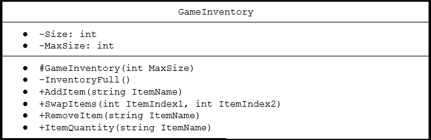

# Introduction

In this document I will discuss the creation of an RPG game inventory system using MultiSet design with a Sequence\<"string">. The string will represent an ID of an item in the game world. This ID is mapped to another system for item qualities such as stat modifiers, value, and item type. The inventory will max out at 64 items for player characters and will be adjustable based off of a private variable. The items in the game will not stack and instead all individually take up an inventory slot. There will also be a hop bar displayed to the player at all times where items can be used quickly. The inventory will be displayed to the user in an 8x8 grid with the first position being filled with the first item and then the first item of the second row being the 9th element of the list. The player will be able to move items around their inventory so they can organize it to their own wants.

# Design Philosophy

My main reason for utilizing a Sequence as my MultiSet basis is for the simplicity and ease of readability for other developers when working with it. Other developers will use this multiset when programming character functions in the game as the inventory is very closely tied with characters. It will also be used with the item ID mapping system so that items can have large property sets. Players will be the users with this system while playing the game and managing their items.

# Core Operations

Any Multiset design is going to need to do a handful of operations to be able to be used properly as the game inventory. Below are a couple of the operations needed.

## Operation 1

One of the first major operations needed for the inventory system is the capability to add new items to the inventory. This is necessary for when a character picks up loot, purchases items from a vendor or when the character trades with another player. This is directly supported through the Sequence. It will have a time complexity of O(1) as all insertions will happen as push_backs at the end of the list. Before the operation is completed a check will be preformed that the inventory is not full. After an insertion completes successfully a boolean value known as InventoryFull will be adjusted if the size of the inventory has reached the cap of 64.

## Operation 2

Another major operation needed for the inventory system is the capability to remove an item from the inventory. This would be needed when a character uses a disposable item, sells something to another character or drops an item on the ground. This is directly supported with a Sequence and will have a worst-case time complexity of O(n) this is because the item needs to be found in the sequence and if it is the last item it has to go through every other item first to find a match. After an item has been removed from the list it will check if the InventoryFull boolean was asserted. If it was asserted it will be turned off otherwise it will not be changed.

## Operation 3

Another major operation for the inventory would be to access an element given an index. This would be useful for items shown in the inventory hop bar that can be used as they would be able to be used immediately. This would have a time complexity of O(n). The worst case is when the item accesses is in the max slot of the inventory. If the item is used often and the character has it near the front of the inventory the time complexity will be lower. Regardless because of the low max slot being used for player characters (64 slots) the O(n) time complexity does not hurt the Sequence a great amount.

## Operation 4

One other thing that the inventory is going to need to be able to do is swap items between different indexes. This would be done by giving the index of the two items to be swapped from the front end and then removing them from the inventory before inserting them back in each others places. This prevents them from accidently inserting over the inventory limit. This should be a very straightforward operation and will not have super complex coding or timing.

Below is brief example of how this could look:

~~~

swapItems(itemIndex1, itemIndex2){
    item1 = list[itemIndex1]
    item1 = list[itemIndex2]
    list.erase[itemIndex1]
    list.erase[itemIndex2]
    list.insert(itemIndex1, item2)
    list.insert(itemIndex2, item1)
}

~~~

The worst case time complexity of this would be O(1). This is because all functions that are being done have a time complexity of O(1) being index based operations.

## Operation 5

A final major operation needed is access to how large the inventory currently is. The use of how large the inventory is comes in assessing whether or not the inventory is full yet. This would be obtained by taking the index of the last element in the Sequence and adding 1. This results in an O(1) time complexity. There are no specific edge cases to be explored for this operation.

# Set Operations

A useful set operation for my game inventory would be union_with. This could be useful in adding full loot selections from a monster drop. When monsters are slain a pop-up grid with up to 4 items to be picked up will be displayed. To grab all items at once a union would work well. It would be implemented via adding all elements from the monsters loot grid in to a temporary inventory along with all items from the players inventory. This temporary inventory would be checked to ensure it matches the constraints on inventories regarding size and if it is okay made the players new inventory. Otherwise the player will be unable to do a pick up all from the monster.

# Extension Feature

Getting a quantity count of how many of a single item is in the inventory would be helpful in some display cases. One use in particular would be in displaying how many of an item like a potion the character has in the hop bar or during trade. The time complexity of this is O(n) as one needs to go through entire list to add up all of the instances of the item. This operation is slow for an extremely large inventory but I do not expect item amounts in an inventory to become large enough for awful performance to be had. This is one of the major weaknesses of the Sequence when using with just a string as the data type as there is no other way to find quantity than iterating through. Part of my reason for limiting inventory space to 64 items was to account for this weakness of the Sequence. This would be a function that would return the quantity to the hop bar or trade view. Since these will be much smaller windows than the standard inventory it will not be the largest ask computationally wise.

# UML Diagram

The members Size and MaxSize are private members that should only be adjusted by the class methods and functions so that they are kept in proper order for gameplay mechanics. InventoryFull is private as it will only end up being used by internal operations that are adding items or for set operations. The rest of the functions are public as they will be accessed by outside classes and instances like a Shop class where a vendor could sell and buy from the player character. It would also be used in fight operations when the player character would pick up loot from a mob or other character.

# Trade-off Analysis
## Compare basics of the two structures

The basic setup of the hash table is similar to the Sequence. They are both able to be accessed and modified via an index. The hash table is better at utilizing quantities than the Sequence is. With the hash table I could easily implement having multiple of one item within a slot of the table instead of needing separate functionality to count how many are had.  

## Why did I not choose the hash table?
I did not use a Hash Table as I decided that not having “stacks” of items was not an issue with the design of the game. One of the other big issues with using a HashTable instead of a Sequence is the added complexity of the HashTable. Needing to implement a hash function along with probing would be additional effort that is not required for a Sequence. I did not believe that the benefits with quantities was worth the additional effort for hashing procedures to be made

|   | Sequence  | Hash Table  |
|---|---|---|
| Advantages | Simplicity, Readability  | Easier to store quantity directly   |
| Disadvantages  | Quantity based operations slow  | More complex to set up |
| New Item Complexity  | O(1)  | O(n)  | 
| Remove Item Complexity  | O(n)  | O(n)  | 
| Swap Complexity  | O(n)  | O(n)  | 
| Inventory Size Complexity  | O(1)  | O(1)  | 

# Alternative Design Sketch

If I had fully gone with utilizing a HashTable instead of a Sequence my limitation of inventory slots would be very different than with my Sequence. I would be able to use "stacks" of items as described in the previous section. This implementation could have made gameplay more fun and interesting as you could hold more items since they would not all take up their own slots in the inventory.

# Evaluation Plan

## Evaluation

To fully evaluate the Sequence a set of tests would need developed to show proper functionality. These tests would consist of operations that a player would be using against the inventory. Ensuring that it works properly for when they are interfacing with it. This would include swapping procedures, inserting procedures and other small tests. I would then need to have a print out of the inventory after each operation to ensure that it occurred properly. 

## Customizability and Expandability

To make sure that it would continue working for other use cases I want to utilize many private variables so that it can be highly customized for different cases. While the player character should have a max inventory size of 64 things like monsters or non-playable characters will not have as large of an inventory. Being able to modify options like this help in making it more easily utilized. 

# Conclusion

